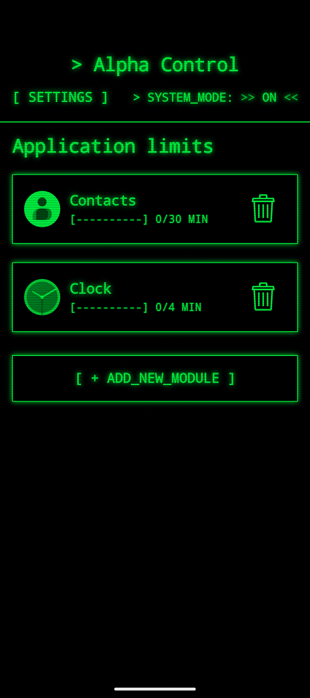
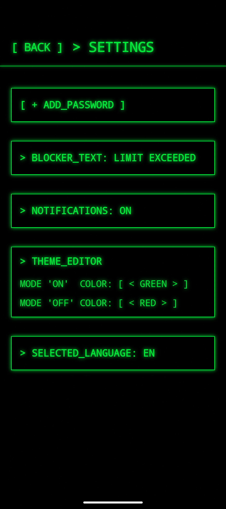
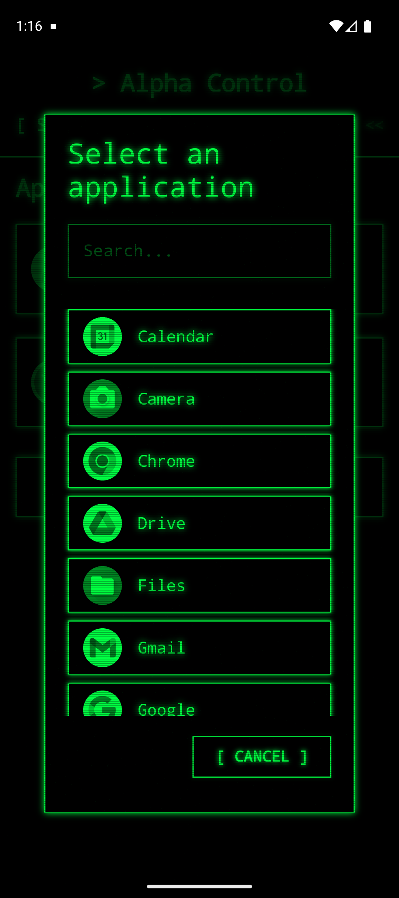

# [Alpha Control] — Retro-Terminal Digital Self-Control System

  

  
  
  

**Alpha Control** is a digital health tool designed to combat app addiction. It monitors screen time and forcibly blocks access once limits are exceeded. The entire interface is crafted in a "Retro-Terminal" aesthetic, featuring dynamic CRT (Cathode Ray Tube) effects, scanlines, and "Matrix" animations.

---

## 📸 Visual Showcase

| Main Dashboard | System Settings | Select Menu |
| :---: | :---: | :---: |
|  |  |  |
| *Real-time usage monitoring* | *Theme and password config* | *Application selection menu* |

### 🎞 UI Dynamics & Effects

  <table border="0" align="center">
    <tr>
      <td align="center" width="50%">
         
        <b>Matrix-style blocking overlay</b> 
        <i>Intercepts user interaction when limits are reached</i>
      </td>
      <td align="center" width="50%">
         
        <b>CRT & Flickering Effects</b> 
        <i>Real-time retro-terminal scanlines and glitch system</i>
      </td>
    </tr>
  </table>

---

## 🚀 Key Features

- **Real-time Monitoring**: A background Foreground Service analyzes user activity via `UsageStatsManager`.
- **Intelligent Blocking**: A full-screen system overlay with a "Matrix" animation that intercepts user interaction when limits are reached.
- **Custom UI Engine**: Hand-crafted shaders and effects (flicker, glitches, scanlines) built entirely with Jetpack Compose.
- **Security System**: Password-protected settings to prevent bypassing restrictions.
- **Dynamic Localization**: Full RU/EN support that switches "on the fly" using a custom `LocaleHelper`.
- **Theme Editor**: Customizable terminal palettes (Green, Red, Amber, etc.) for both active and inactive system states.

---

## 🛠 Tech Stack

- **Language**: Kotlin + Coroutines (Flow/StateFlow).
- **UI**: Jetpack Compose (Custom Draw Modifiers, Canvas API).
- **Architecture**: MVVM + Clean Architecture principles.
- **Database**: Room Persistence Library (storing app limits).
- **System Components**:
    - `Foreground Service` for persistent monitoring.
    - `WindowManager API` for drawing system-level overlays.
    - `UsageStatsManager` for precise screen time analysis.

---

## 🧠 Technical Challenges & Solutions

### 1. Visual Effects (CRT Effect)
To achieve the "Old Monitor" vibe, I developed a custom `Modifier.crtEffect` that:
- Generates dynamic noise and scanlines using the Canvas API.
- Implements a high-frequency flicker using `rememberInfiniteTransition`.
- Injects random "glitch" artifacts based on frame timestamps.

### 2. Background Efficiency
The `MonitoringService` is optimized to poll the system every 5 seconds on `Dispatchers.IO`. This ensures the system reacts immediately to blocked apps while maintaining minimal battery consumption.

### 3. Dynamic Context Injection
By overriding `attachBaseContext` and using a custom `LocaleHelper`, the app handles language changes internally. This avoids relying on system-wide locale settings and allows for a seamless "Terminal-like" language toggle.

---

## ⚙️ Installation & Requirements

1. Clone the repository.
2. Open the project in **Android Studio Ladybug (or newer)**.
3. The app requires the following system permissions:
    - **Usage Access**: To monitor which app is currently in the foreground.
    - **Display Over Other Apps**: To show the blocking screen.

---

## 🔐 Restricted Settings Guide (Android 13+)

On newer Android versions, the system may block "Display over other apps" or "Usage Access" for apps installed via APK (not from Play Store). This is called **"Restricted Settings"**.

To enable the system functionality, follow these steps:

1. Open **Settings** on your device.
2. Go to **Apps** -> **All Apps** -> find and tap **Alpha Control**.
3. In the top right corner, tap the **three dots** (⋮) or "More" icon.
4. Tap **"Allow restricted settings"**.
5. Authenticate (use your fingerprint or PIN) if prompted.
6. Now you can return to the app and grant the necessary permissions normally.

---

## 👨‍💻 Connect with me

If you have any questions or want to discuss the project, feel free to reach out!

**Fairlak**  
*Android Developer | System Utilities & Custom UI Enthusiast*